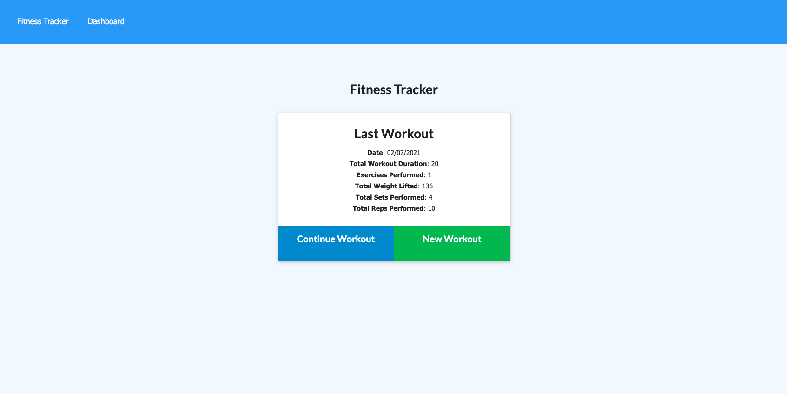
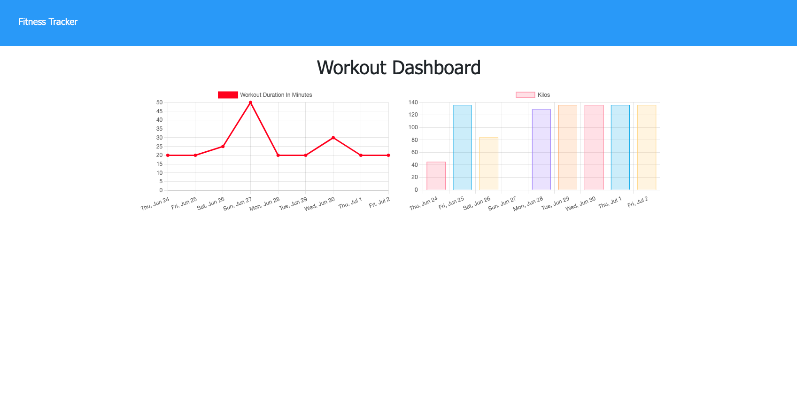

# Workout tracker

  

  ## Description
  A place where you can track your workouts. Add each exercise and see your progress overtime by looking at your dashboard.

  ## Table of Contents
  - [Installation](#installation)
  - [Usage](#usage)
  - [How to contribute](#contribute)
  - [Screenshots](#screenshots)
  - [Deployed app](#app)
  - [License](#license)
  - [Questions](#questions)

  ## Installation
  `npm i` and then `npm start` it will run locally on `http://localhost:3000`

  ## Usage
  via Heroku, or you can run it locally by installing the db and setting up a .env and running npm start.

  ## Technologies used
  Node.js, Express, MongoDB, mongoose, NOSQL, JS.

  ## Contribute
[Email: watts.e.michele@gmail.com](mailto:watts.e.michele@gmail.com)

  ## Screenshots
  
  

## App
[The deployed app](https://still-hollows-78707.herokuapp.com/)

  ## License

Permission is hereby granted, free of charge, to any person obtaining a copy of this software and associated documentation files, to deal in the Software without restriction, including without limitation the rights to use, copy, modify, merge, publish, distribute, sublicense, and/or sell copies of the Software.

  ## Questions
  [Github: michellewatts20000](https://github.com/michellewatts20000)
   
  [Email: watts.e.michele@gmail.com](mailto:watts.e.michele@gmail.com)
